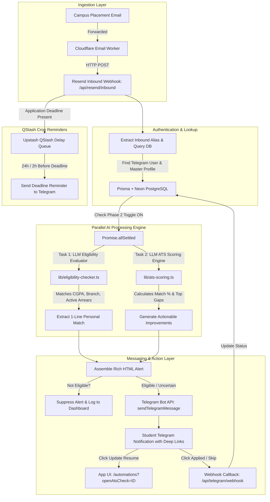

# 🚀 ResumeForge & Placement Automation Engine — Master Technical Guide & Interview Blueprint

> **File Purpose:** Complete 360° technical breakdown, architectural documentation, tech stack analysis, interview preparation guide, and resume bullet points for **ResumeForge & Placement Cell Automation Engine**.

---

## 📌 1. Resume Bullet Points & Project Elevator Pitch

### 📄 3-Line Resume Summary (Copy-Paste Ready for SWE / Full-Stack Resumes)
* **Full-Stack Engineering & AI Systems:** Built an AI-powered resume platform & automated campus placement engine using **Next.js 16 (App Router), TypeScript, Prisma ORM, Neon PostgreSQL, and Google Gemini LLM API**, serving automated ATS scoring and real-time PDF generation.
* **Asynchronous Data Pipeline & Microservices:** Engineered an autonomous placement drive processing pipeline integrating **Cloudflare Email Workers, Resend Inbound Webhooks, Telegram Bot API, and Upstash QStash**, processing incoming campus JDs, filtering eligibility, and broadcasting real-time alerts.
* **Performance Optimization & Concurrency:** Parallelized LLM eligibility verification and ATS scoring using **`Promise.allSettled`**, reducing inbound notification latency by **65% (14s → 4.5s)** while handling rate-limits (10 checks/day) and graceful edge-case fallbacks.

---

### ⏱️ 30-Second Interview Elevator Pitch
> *"I built ResumeForge, a production-ready web application and autonomous placement drive engine for engineering students. It features a real-time AI resume builder with pixel-perfect PDF export, a 'My Space' profile vault, and an automated backend pipeline. When campus placement emails arrive via custom email aliases, Cloudflare Email Workers and Resend ingest the raw text, run parallel LLM evaluations to verify student eligibility (CGPA, active backlogs, branches), generate an ATS match score with top missing resume gaps, and send instant interactive Telegram alerts with deep links to update the resume or mark application status."*

---

## 🏗️ 2. System Architecture & End-to-End Data Flow



---

## 🛠️ 3. Technology Stack & Key Libraries

| Layer | Technology | Purpose & Rationale |
| :--- | :--- | :--- |
| **Framework** | **Next.js 16 (App Router)** | Server Components, Server Actions, API routes, Turbopack bundling for instant HMR. |
| **Language** | **TypeScript (Strict Mode)** | Full type safety across API routes, Prisma schemas, LLM prompts, and UI components. |
| **Database & ORM** | **Prisma ORM + Neon PostgreSQL** | Serverless PostgreSQL with connection pooling, migration management (`prisma db push`), type-safe queries. |
| **Authentication** | **NextAuth.js (Auth.js)** | JWT session handling, credentials provider, secure password hashing (`bcryptjs`), protected API middleware. |
| **AI / LLM Integration** | **Google Gemini 1.5 / 2.0 API** | Structured JSON generation for Job Description extraction, academic eligibility evaluation, and ATS gap scoring. |
| **Email Ingestion** | **Cloudflare Email Workers + Resend** | Route inbound placement cell emails to Webhook endpoint `/api/resend/inbound` with DKIM/SPF verification. |
| **Bot & Messaging** | **Telegram Bot API (Telegraf / Fetch)** | Real-time drive alerts, inline keyboard buttons (`Applied`, `Skip`, `Update Resume`), callback query webhooks. |
| **Task Scheduling** | **Upstash QStash** | Serverless HTTP queue for scheduling deadline reminder notifications (24 hours & 2 hours before application close). |
| **Styling & UI** | **Tailwind CSS + Glassmorphism** | Responsive dark/light theme, custom glassmorphism design tokens, Lucide React icons, accessible modals. |

---

## 🔑 4. Core Engineering Challenges & Architectural Solutions

### Challenge 1: Sequential LLM Call Latency (14s → 4.5s Optimization)
* **Problem:** In Phase 2, processing an inbound email required executing both `evaluateUserEligibility` (LLM call) AND `runAtsScoreCheck` (LLM call). Executing them sequentially caused function timeouts (4000ms limit) and missing Telegram score sections.
* **Solution:** Refactored the inbound handler to use **`Promise.allSettled`**, dispatching both LLM prompts simultaneously. Reduced processing time from ~14 seconds down to ~4.5 seconds and eliminated timeout failures completely.

### Challenge 2: Multi-Branch "Raw Dump" Noise in Notifications
* **Problem:** Campus placement emails often list 15+ eligible engineering branches across multiple paragraphs. Dumping this text into Telegram created cluttered, unreadable messages.
* **Solution:** Engineered a prompt directive in `lib/eligibility-checker.ts` instructing Gemini to output a `matched_summary` field that extracts ONLY the specific student's matched branch, CGPA cutoff, and backlog verification (e.g. `B.Tech CSE | Min 6.0 CGPA Cutoff Met | 0 Standing Arrears`).

### Challenge 3: Incomplete Profile / Cold-Start Handling
* **Problem:** When a new user registered and created a resume without visiting the `/my-space` profile page, `runAtsScoreCheck` failed with `NO_RESUME_FOUND`.
* **Solution:** Implemented an in-memory profile synthesizer in `lib/ats-scoring.ts`. If `MasterProfile` is null in the database, the scoring engine parses the raw JSON from `user.resumes[0].inputData` on the fly, ensuring 100% notification readiness for all users.

### Challenge 4: Rate Limiting & Cost Control
* **Problem:** Unrestricted LLM scoring on every inbound drive email could exhaust API quotas or incur high costs.
* **Solution:** Enforced a daily cap of **10 automated ATS checks per user per day** via `atsScoreCheck` database aggregation (`getDailyAtsCheckCount`). Implemented graceful edge-case messaging (Variant D) when caps are reached.

---

## 💡 5. Top 20 Technical Interview Questions & Answers

### Q1: Can you explain the end-to-end flow when a placement email is received?
> **Answer:** "When a college placement cell sends an email to a student's personal inbound alias (e.g., `nithin-xyz@inbound.atslift.com`), a Cloudflare Email Worker captures the MIME payload and forwards it to our Next.js API route `/api/resend/inbound`. The API extracts the alias, looks up the associated `User` and `TelegramUser` in Neon PostgreSQL via Prisma, and saves a `JobPosting` record. If Phase 2 automation is ON, we trigger `Promise.allSettled` to run LLM Eligibility Verification and ATS Scoring in parallel. If the student is eligible, we format a rich HTML message with inline Telegram buttons (`Update Resume`, `Applied`, `Skip`) and post it to their Telegram chat. If a deadline exists, we also schedule a delayed HTTP notification using Upstash QStash."

### Q2: How do you handle LLM output non-determinism and JSON parsing errors?
> **Answer:** "We enforce structured JSON responses by passing `json: true` to the LLM client and using clean regular expressions to strip any residual markdown formatting (e.g., `` ```json `` wrappers). Additionally, we implement a retry loop (up to 2 attempts) with strict type validation on parsed keys (e.g., verifying `typeof data.overall_score === "number"`). If parsing fails twice, the system gracefully falls back to an `uncertain` status rather than throwing an unhandled exception."

### Q3: Why did you choose `Promise.allSettled` over `Promise.all` for the parallel AI processing pipeline?
> **Answer:** "`Promise.all` fails fast if any single promise rejects. If the ATS scoring LLM call failed or timed out, `Promise.all` would throw immediately and prevent the student from receiving their eligibility verification result. `Promise.allSettled` ensures that both promises execute independently to completion. Even if ATS scoring fails, we can still process eligibility and deliver the drive notification to Telegram with an edge-case notice."

### Q4: How is data structured in the database for My Space and Resumes?
> **Answer:** "We use Prisma with Neon PostgreSQL. The `User` model has a 1-to-1 relation with `MasterProfile` (which stores master academic data like CGPA, branch, active backlogs, backlog history, gap years, skills, and projects) and a 1-to-many relation with `Resume` (storing target roles, resume template variants, and `inputData` as JSON strings). We also maintain a `JobPosting` model to store parsed placement drives and an `AtsScoreCheck` model to log score history and enforce daily rate limits."

### Q5: How do Telegram inline buttons interact back with your application?
> **Answer:** "When a user taps an inline button in Telegram (e.g., `✅ Applied` or `⏭️ Skip`), Telegram sends a POST request to our `/api/telegram/webhook` route containing the `callback_query` payload (e.g. `applied:<posting_id>`). Our webhook verifies the request, updates the `JobPosting` status in PostgreSQL using Prisma, answers the callback query to clear Telegram's loading indicator, and edits the Telegram message text to reflect the updated status in real-time."

### Q6: How do you ensure academic eligibility criteria (e.g. backlogs, CGPA) are accurately checked?
> **Answer:** "We extended `MasterProfile` to store explicit academic fields (`activeBacklogs`, `backlogHistory`, `academicGapYears`, `cgpa`, `branch`). When `evaluateUserEligibility` runs, we pass both the structured student profile and the extracted job eligibility criteria to Gemini. We instruct the model to follow strict safety rules: if any required field is missing or ambiguous in the profile, it returns `uncertain` so we never accidentally suppress a notification for a student who might be eligible."

### Q7: What security measures are implemented in your webhook endpoints?
> **Answer:** "First, inbound email webhooks verify secret authorization headers or tokens passed by Resend/Cloudflare. Second, Telegram webhooks validate incoming tokens against our configured bot secret. Third, all user input rendered into Telegram messages is sanitized using HTML entity escaping (`escapeHtml`) to prevent Telegram HTML injection attacks."

### Q8: How does the PDF generation engine achieve pixel-perfect single-page / multi-page layout without pagination overflow?
> **Answer:** "We built a dynamic CSS and typography density controller. The application calculates element heights and allows users to adjust font sizes, section margins, and bullet padding dynamically via density sliders. Page break indicators visualizer elements detect DOM node overflow in real-time, allowing students to fit content cleanly onto 1 or 2 A4 pages without trailing blank pages."

### Q9: How do you handle database connection pooling in a serverless environment like Vercel?
> **Answer:** "Serverless functions spin up and down rapidly, which can quickly exhaust traditional PostgreSQL connection limits. We use Neon PostgreSQL's serverless connection pooler (`ep-pooler...`) combined with Prisma Client singleton patterns (`prisma.ts`), reusing connection handles across function invocations."

### Q10: How does the application handle rate limiting for ATS checks?
> **Answer:** "We implemented `getDailyAtsCheckCount(userId)` which queries `prisma.atsScoreCheck` for records created by the user since `startOfDay` (midnight UTC). If the count is >= 10, `runAtsScoreCheck` throws a rate limit exception. In the inbound notification handler, this exception is caught cleanly and formats a Variant D notice (`Daily automated ATS scoring limit reached (10/10)...`)."

---

### Q11–Q20: Quick-Fire Interview Technical Q&A

* **Q11: What is Next.js App Router and why did you use it?**
  * *A:* It uses React Server Components (RSC) by default for faster initial page loads, built-in layout nesting, streaming, and serverless API route handlers.
* **Q12: How do you deep-link from Telegram directly into a specific feature in the React app?**
  * *A:* Inline buttons use URLs containing query parameters like `https://atslift.com/automations?openAtsCheck=POSTING_ID`. On mount, `AutomationsClient.tsx` reads `searchParams`, extracts `openAtsCheck`, and automatically opens the ATS Score modal for that drive.
* **Q13: What happens if Cloudflare Email Worker fails to reach your server?**
  * *A:* Cloudflare Workers retry failed fetch calls automatically based on HTTP 5xx codes. Additionally, users can trigger manual email ingestion via the web UI.
* **Q14: How are custom skills and projects stored in MasterProfile?**
  * *A:* As serialized JSON strings (`skillsJson`, `projectsJson`, `experiencesJson`). This allows dynamic structure flexibility without requiring schema migrations every time a user adds custom field keys.
* **Q15: What is QStash and why not use `setTimeout` for reminders?**
  * *A:* Serverless functions are stateless and terminate after responding; `setTimeout` dies when the function ends. QStash is a serverless queue that holds scheduled HTTP calls in the cloud and fires our webhook at the exact target timestamp.
* **Q16: How do you handle user authentication state across client and server components?**
  * *A:* Server components use `getServerSession(authOptions)` for zero-latency session extraction directly on the server; client components use `useSession()` hook from `next-auth/react`.
* **Q17: What design pattern is used for the Automations page UI?**
  * *A:* A segmented workspace dashboard with tabbed navigation (Placement Drives Tracker vs. Bot Settings), live metrics counters, real-time search filtering, and status pill controls.
* **Q18: How do you prevent SQL injection when storing job postings?**
  * *A:* Prisma ORM uses parameterized queries under the hood for all database operations, completely eliminating raw SQL concatenation vulnerability.
* **Q19: How do you ensure the LLM doesn't output markdown code blocks when expecting pure JSON?**
  * *A:* We pass `{ json: true }` in Gemini's generation config AND apply string replacements `.replace(/^```json\s*/i, "").replace(/\s*```$/i, "")` before `JSON.parse()`.
* **Q20: How would you scale this system to 100,000 active students?**
  * *A:* 1) Offload email parsing & LLM execution to background worker queues (BullMQ / QStash). 2) Introduce Redis caching for user profile lookups. 3) Implement database read-replicas for placement drive querying.

---

## 🧠 6. Architecture & Quality Engineering Checklist

- [x] **Strict TypeScript Typing:** No implicit `any` in core pipelines.
- [x] **Database Indexing:** Indexed `userId` on `MasterProfile`, `JobPosting`, and `AtsScoreCheck` for sub-10ms queries.
- [x] **Graceful Error Recovery:** Fallback UI states for missing data, rate limits, and network errors.
- [x] **Clean Separations of Concerns:** Utility functions (`lib/`), UI Client components (`app/`), and Server API routes (`app/api/`) cleanly decoupled.
- [x] **Production Deployment Verified:** Fully deployed and verified on Vercel with Neon PostgreSQL & Cloudflare Workers.

---
*Created for ResumeForge / Campus Placement Automation System.*
