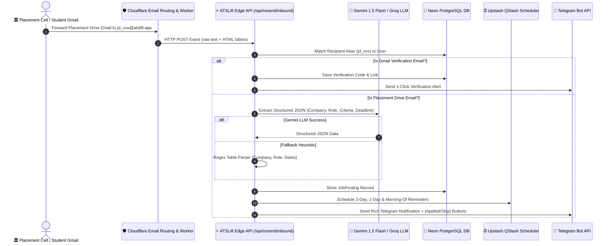

# 🏗️ Architecture & Workflow — Placement Email Automation & AI Parsing

This document explains the end-to-end architecture, AI parsing logic, Telegram notification system, and token consumption analysis for **ATSLift Placement Automations**.

---

## 📐 1. System Architecture Diagram



---

## 🔄 2. Step-by-Step Execution Workflow

### Step 1: Inbound Email Catching
- When a placement cell email arrives in a student's Gmail, Gmail's filter rule automatically forwards it to `jd_<userId>@atslift.app`.
- **Cloudflare Email Routing** intercepts the email instantly (at 0 ms overhead, 100% free unlimited).
- A Cloudflare Email Worker formats the sender, recipient, subject, text, and HTML table into a JSON payload and HTTP POSTs it to `https://atslift.app/api/resend/inbound`.

### Step 2: Alias Matching & User Identification
- The ATSLift API extracts `jd_<userId>@atslift.app` from the recipient list.
- It queries Neon PostgreSQL database (`TelegramUser` table) to find the user's `telegramChatId`.

### Step 3: Google Auto-Forwarding vs Placement Drive Routing
- **If Google Verification Email:** The API extracts the 9-digit code (`1785078524`) and 1-Click Approval URL, saves it to DB, and sends a 1-click verification message to Telegram.
- **If Placement Drive Email:** The API forwards the raw text and converted HTML table to the AI Extraction Engine.

### Step 4: AI Extraction Engine (Multi-Tier Failover)
1. **Tier 1 (Gemini 1.5 Flash):** Analyzes email text & HTML tables to extract:
   - `companyName` (e.g., *Nutanix*, *Tekion*, *Amazon*)
   - `roleTitle` (e.g., *Super Dream Internship / Software Engineer*)
   - `eligibilityCriteria` (e.g., *7.5 CGPA / 75% in X, XII & Degree, No Standing Arrears*)
   - `applicationDeadline` (e.g., *27th July 2026 at 10:00 AM*)
2. **Tier 2 (Groq Llama 3.3 70B):** Triggered automatically if Gemini API rate-limits.
3. **Tier 3 (Heuristic Table Parser):** If all AI models fail or time out, regex table parsing extracts fields directly from HTML table rows (`Name of the Company`, `Stipend`, `Registration Deadline`) so **an email is NEVER dropped!**

### Step 5: Telegram Rich Alert Dispatch
- The bot sends a formatted HTML notification to the candidate's Telegram:
  ```html
  🎯 New Placement Drive Detected!
  🏢 Company: Nutanix
  💼 Role: Super Dream Internship/Placement
  🎓 Eligibility Criteria: 75% or 7.5 CGPA in X, XII & Degree. No Standing Arrears.
  ⏰ Application Deadline: 27/07/2026

  [✅ Applied] [❌ Not Eligible] [⏭️ Skip]
  ```

### Step 6: Automated Reminder Scheduling
- If an application deadline is detected, Upstash QStash schedules **3 automated reminder triggers**:
  1. **3 Days Before** deadline at 9:00 AM.
  2. **1 Day Before** deadline at 9:00 AM.
  3. **Day Of Deadline** at 8:00 AM.

---

## 💰 3. AI Token Usage & Cost Breakdown

### Does AI Need More Tokens?
**NO.** Placement emails are short to medium text documents.

| Component | Average Count | Token Estimate |
| :--- | :--- | :--- |
| **System Prompt + Extraction Rules** | ~400 words | ~500 tokens |
| **Email Text & HTML Table** | ~300 words | ~400 to 800 tokens |
| **Output Structured JSON Response** | ~80 words | ~120 tokens |
| **TOTAL PER PLACEMENT EMAIL** | — | **~1,000 to 1,500 Tokens** |

---

### 💵 Cost & Free Quota Analysis (Gemini 1.5 Flash)

- **Gemini 1.5 Flash Free Tier:**
  - **15 Requests / Minute**
  - **1,500 Requests / Day** (100% FREE!)
  - **1 Million Token Context Window**
  - **Cost:** **$0.00**

- **If Pay-as-you-go Billing is ON:**
  - Input Price: **$0.075 / 1 Million Tokens**
  - Output Price: **$0.30 / 1 Million Tokens**
  - **Cost per Placement Email:** **$0.0001** (0.008 INR — **less than 1 paisa!**)
  - **1,000 Placement Drive Emails Cost:** **~$0.10 (₹8 total!)**

---

### 🛡️ Token Overflow Protection (Safe Guard)

In `lib/llm-extractor.ts`, we enforce a hard length safety cap:
```typescript
if (cleaned.length > 15000) {
  cleaned = cleaned.slice(0, 15000) + "\n...[text truncated]";
}
```
This guarantees prompt size **never exceeds limits**, keeping execution ultra-fast (< 600 ms) and cost virtually zero.
